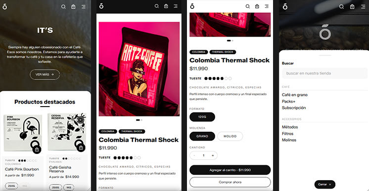
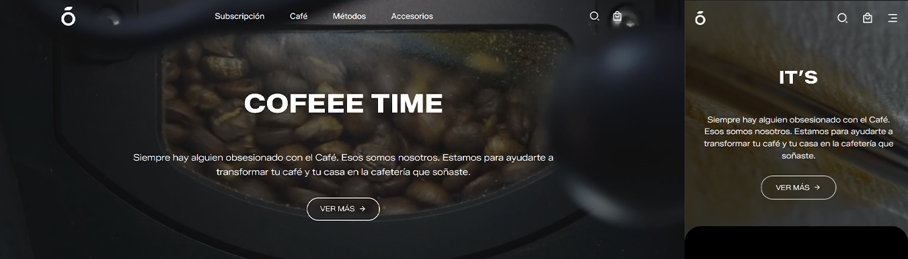

## Vistas previas
<table>
    <tr>
        <td>Phone</td>
        <td></td>
    </tr>
    <tr>
        <td>Desktop</td>
        <td></td>
    </tr>
</table>

# Ecommerce Coffee Demo

Una plataforma web ecommerce para vender café, accesorios, cafeteras y productos relacionados a una tienda cafetería o tostador independiente.

## Objetivo

Demostrar una base funcional y reusable de una tienda online centrada en café, con enfoque mobile-first y componentes UI reutilizables (Navbar, Banner, Footer), lista para evolucionar a un proyecto real.

## Features

- Experiencia mobile-first: navegación y vistas optimizadas para móviles.
- Catálogo navegable: permite ver productos de café y accesorios.
- Secciones de tienda: organización por categorías (Café, Accesorios, Métodos, Packs, etc.).
- Detalle de producto: imágenes, niveles de tueste, precios mínimos, y formatos disponibles de café.
- Carruseles de productos e imágenes: exploración rápida y visual.
- Obtener una recomendación de producto Café a través de quiz de recomendación. 

## Stack Tecnológico

- React (Vite) para frontend
- JavaScript + CSS puro (sin framework CSS)
- React Router para navegación
- Opcionalmente integrable con backend Java/Spring Boot en proyectos reales (futuro)

- API servicio de productos: Integración de servicio de productos para obtener catálogo, detalles de productos y recomendación de producto a través de formulario. Información y uso: https://github.com/fabetabilo/demo-coffee-ecommerce-product-service

## Requisitos Previos

- Node.js 18+ (recomendado LTS). Verifica versión:

```powershell
node -v
npm -v
```

Descarga e instala desde: https://nodejs.org/

## Instalación y Ejecución

1) Instalar dependencias del proyecto:

```powershell
npm install
```

2) Instalar React Router (si no está ya incluido):

```powershell
npm install react-router-dom
```

4) Instalar Axios
```powershell
npm install axios
```

5) Correr el servidor de desarrollo:

```powershell
npm run dev
```

Vite te mostrará la URL local (por defecto `http://localhost:5173`).

Para levantarlo en red local (Wi‑Fi) y usar el teléfono, ejecuta:

```powershell
npm run dev -- --host
```

Esto expone el servidor en tu IP local para acceder desde otros dispositivos en la misma red. (ej: `http://192.168.196.1:5173`).

## Estructura del Proyecto (resumen)

- `src/assets/`: Archivos personalizados necesarios para la plataforma (Iconos, videos, imagenes, etc).
- `src/components/`: Componentes de la app (Navbar, Footer, Banner, etc).
- `src/config/`: Configuración de API y endpoints.
- `src/css/`: Hojas de diseño de la plataforma.
- `src/hooks/`: Hooks reutilizables para lógica de UI (carruseles, navegación, cálculo de precios, rutas de producto, etc.).
- `src/pages/`: Páginas de la plataforma (Home, Tienda, etc.).
- `src/services/`: Servicios de datos; incluye consumo de API de productos.
- `src/utils/`: Utilidades como formateo de moneda y helpers generales.
- `public/preview/preview-1.png`: Imagen de vista previa usada arriba.
- `public/products/`: Simulación de ruta CDN, S3 de imágenes de productos de API.

